####I.安装PhaserEditor  &nbsp; &nbsp;&nbsp;[下载地址](http://phasereditor.boniatillo.com/blog/downloads#)

####II.打开PhaserEditor.exe 

    1、打开编辑器候弹出对话框，选择项目存储的位置（勾选按钮）
    2、创建新项目File-->new-->pahser project 
    3、如图创建添加项目名选择finish完成项目创建
  
    
    4、还可以选择next对phaser的默认参数做一下修改（可以支持typescript）
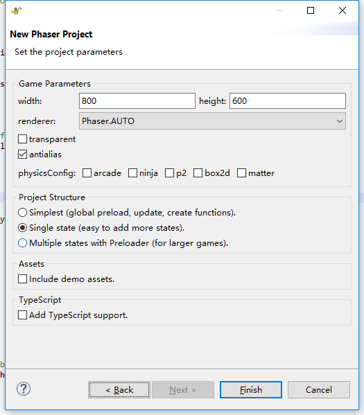   
    
    5、创建后的目录结构是这样的
       assetss是资产包存放资源文件+配置资产包+场景布置等 我们主要是操作资产包
       js文件下的 main.js引导脚本，其中创建游戏  
       index.html起点，像任何其他Web应用程序。
       design 一个文件夹，您可以放置​​不属于游戏的资源，如SVG文件或源图像。

####III 创建级别状态
    
    在创建项目的同时已经创建了一个level的js文件 并且添加到index.html中 此时你只需要点击（如图）或是Alt+F5
    在浏览器中就会显示  hello word！
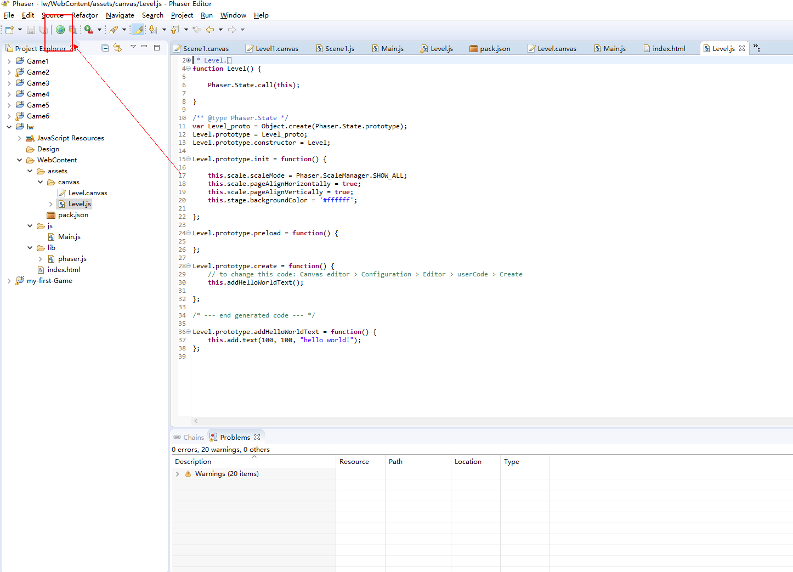 

####IV加载资产

    Assets文件夹，其中包含我们将要使用的所有图像。请复制该文件夹的内容并将其粘贴到游戏项目的WebContent / assets文件夹中。它应该是这样的
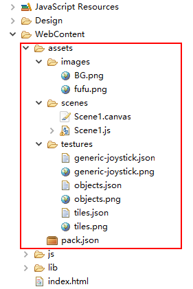    

    在Phaser中，
    1、通过使用特定的加载器方法（如game.load.image，game.load.spritesheet等）加载资源，通过加载每个资源在预加载方法
    2、在清单文件（资产包文件）中，并使用game.load.pack  调用将其加载到预加载方法中  
    在Phaser编辑器中 我们使用第二种 ： 首先声明包中的资产，点击pack.json 打开如下
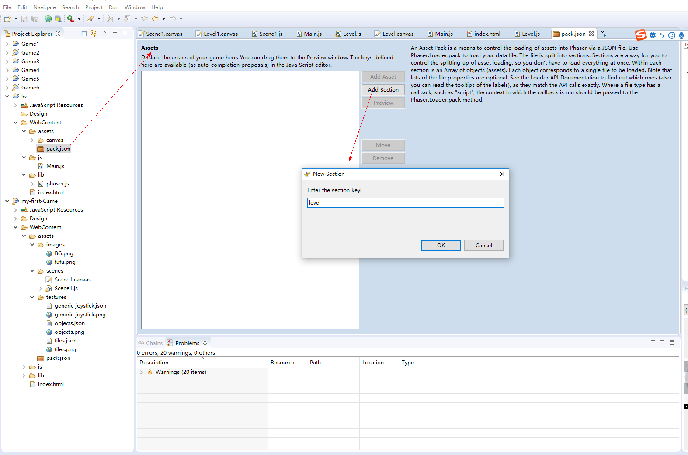     
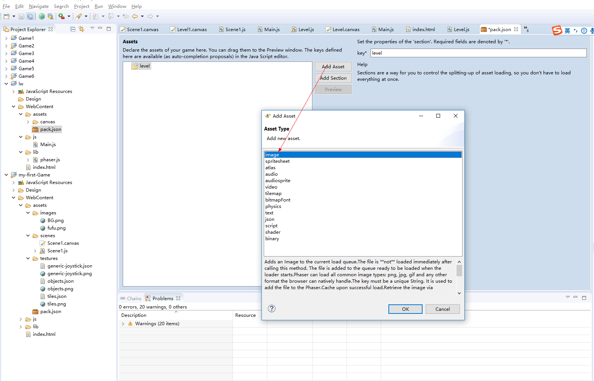     
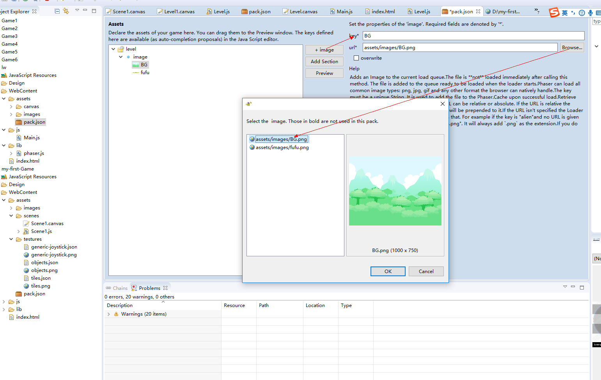     

    添加精灵图  设置width + height
  

    添加纹理图集  请注意，您只需要设置键，textureURL和atlasURL。   
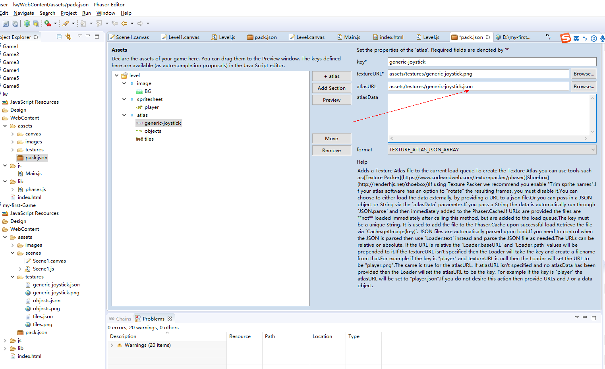    

    完成后在右侧窗口可以看到
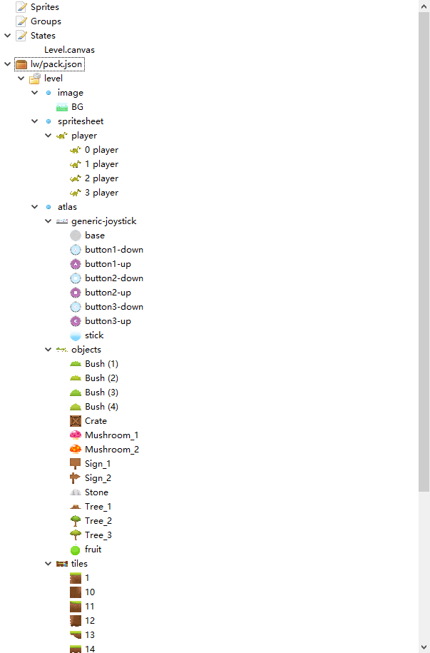     

####创建场景
    创建场景file-->new-->group profab file

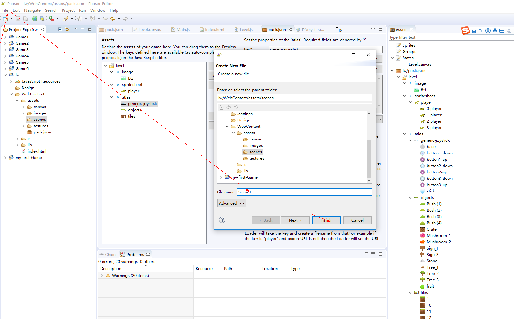  
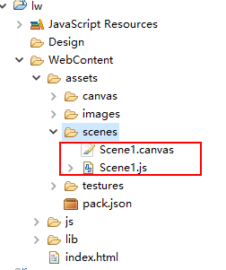  

    打开 Scene1.canvas 拖拽右侧中的精灵至于canvas 画布上
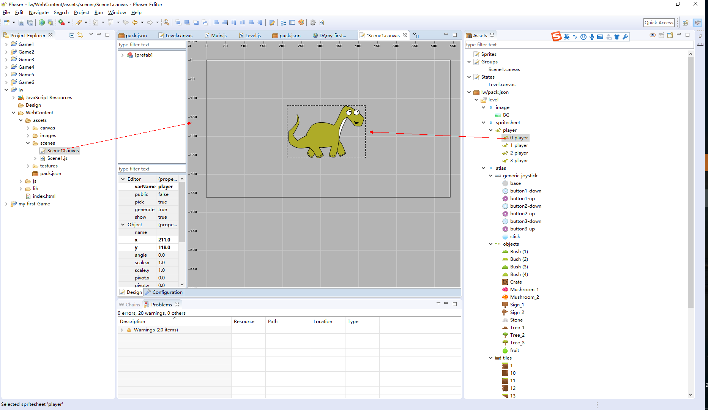  
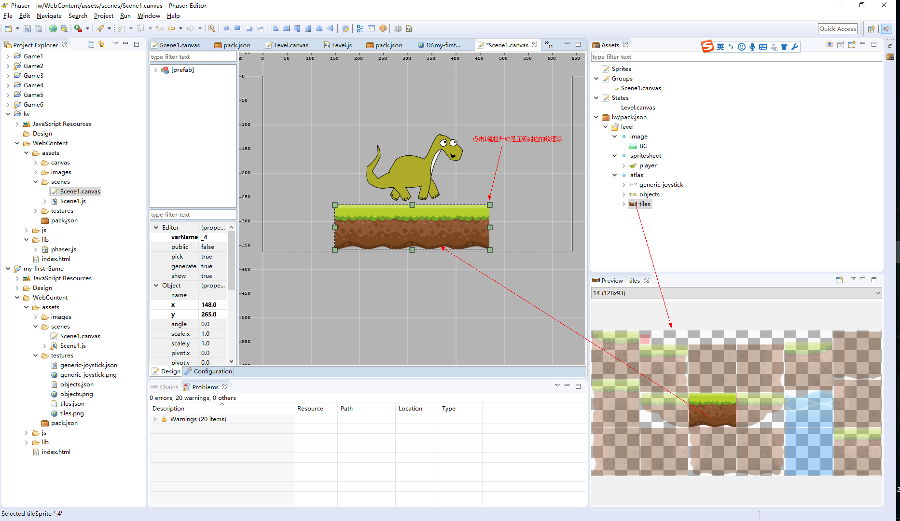  
  

    添加场景自动生成的脚本到pack.josn中  然后 this.load.pack("level", "assets/pack.json");加载包
    this.scene = new Scene1(this.game); 添加场景对象
  
    
    
  
