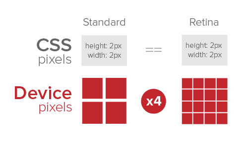

##rem布局方案

 - 为什么要是用rem布局
    ```xlt
       让页面能适配众多不同的终端设备
       注释：什么是适配（我们拿到的设计图一般是以640，750，1080分辨率为基准设计的，而现在的手机终端各式各样，分辨率不同，
       逻辑像素不同 ，视口不同，所以为了让我们的页面在每个设备上都可以良好的展示，那么就需要为这些设备做统一的处理，
       这个过程就称为移动端适配）
    ```
 - 什么是rem
    ```xlt
       CSS长度单位
       css3新单位，相对于根元素html（网页）的font-size，不会像em那样，依赖于父元素的字体大小，而造成混乱。
       除了rem、其他的长度单位：px、em、%、vw、vh等
    ```
    + 什么是px
    ```xlt
        pixel（像素）是图像的基本采样单位。所以它不是一个确定的物理量，也不是一个具体的点或者小方块
        （尽管可以用点和小方块来呈现），而是一个抽象概念。
    ```
    [维基百科](https://zh.wikipedia.org/wiki/%E5%83%8F%E7%B4%A0)
    
    + 什么是em
    ```xlt
        参考物是父元素的font-size，具有继承的特点。如果自身定义了font-size按自身来计算（浏览器默认字体是16px），
        整个页面内1em不是一个固定的值
    ```
    
    + 什么是%
    ```xlt
        一般宽泛的讲是相对于父元素，但是并不是十分准确。
        1、对于普通定位元素就是我们理解的父元素
        2、对于position: absolute;的元素是相对于已定位的父元素
        3、对于position: fixed;的元素是相对于 ViewPort（可视窗口）
    ```
    + 什么是vw
    ```xlt
        css3新单位，viewpoint width的缩写，视窗宽度，1vw等于视窗宽度的1%。
        举个例子：浏览器宽度1200px, 1 vw = 1200px/100 = 12 px。
    ```
    + 什么是vh
    ```xlt
        css3新单位，viewpoint height的缩写，视窗高度，1vh等于视窗高度的1%。
        举个例子：浏览器高度900px, 1 vh = 900px/100 = 9 px。
    ```
 - 一些基本概念
    + 视窗 viewport
    ```xlt
        简单的理解，viewport是严格等于浏览器的窗口。在桌面浏览器中，viewport就是浏览器窗口的宽度高度。
        但在移动端设备上就有点复杂。
        移动端的viewport太窄，为了能更好为CSS布局服务，所以提供了两个viewport:虚拟的viewportvisualviewport和布局的viewportlayoutviewport。
    ```
    [Stack Overflow上对这两个基本概念做了详细的解释。](https://stackoverflow.com/questions/6333927/difference-between-visual-viewport-and-layout-viewport)
    
    + 物理像素(physical pixel)
    ```xlt
        物理像素又被称为设备像素，他是显示设备中一个最微小的物理部件。每个像素可以根据操作系统设置自己的颜色和亮度。
        正是这些设备像素的微小距离欺骗了我们肉眼看到的图像效果
    ```
    
    + 设备独立像素(density-independent pixel)
    ```xlt
       设备独立像素也称为密度无关像素，可以认为是计算机坐标系统中的一个点，这个点代表一个可以由程序使用的虚拟像素(比如说CSS像素)，
       然后由相关系统转换为物理像素。
    ```
    + CSS像素
    ```xlt
        CSS像素是一个抽像的单位，主要使用在浏览器上，用来精确度量Web页面上的内容。一般情况之下，CSS像素称为与设备无关的像素(device-independent pixel)，简称DIPs。
    ```
    + 屏幕密度
    ```xlt
        屏幕密度是指一个设备表面上存在的像素数量，它通常以每英寸有多少像素来计算(PPI)。     
    ```
    
    + 设备像素比(device pixel ratio)
    ```xlt
       设备像素比简称为dpr，其定义了物理像素和设备独立像素的对应关系。它的值可以按下面的公式计算得到：
       设备像素比 ＝ 物理像素 / 设备独立像素
       在JavaScript中，可以通过window.devicePixelRatio获取到当前设备的dpr。而在CSS中，可以通过-webkit-device-pixel-ratio，-webkit-min-device-pixel-ratio和 
       -webkit-max-device-pixel-ratio进行媒体查询，对不同dpr的设备，做一些样式适配(这里只针对webkit内核的浏览器和webview)。
       dip或dp,（device independent pixels，设备独立像素）与屏幕密度有关。dip可以用来辅助区分视网膜设备还是非视网膜设备。
    ```
     
    iPhone6的设备宽度和高度为375px * 667px,可以理解为设备的独立像素；而其dpr为2，根据上面公式，我们可以很轻松得知其物理像素为750px * 1334px。
    
 - 如何实现rem布局
    + meta标签
    ```xlt
       <meta>标签有很多种，而这里要着重说的是viewport的meta标签，其主要用来告诉浏览器如何规范的渲染Web页面，而你则需要告诉它视窗有多大。在开发移动端页面，
       我们需要设置meta标签如下：
       <meta name="viewport" content="width=device-width, initial-scale=1, maximum-scale=1">
       代码以显示网页的屏幕宽度定义了视窗宽度。网页的比例和最大比例被设置为100%。
    ```
    + CSS单位rem
    ```xlt
       在W3C规范中是这样描述rem的:
       font size of the root element.
       简单的理解，rem就是相对于根元素<html>的font-size来做计算。而我们的方案中使用rem单位，是能轻易的根据<html>的font-size计算出元素的盒模型大小。
       而这个特色对我们来说是特别的有益处。 
    ```
    
    + 前端实现方案(lib-flexible)
        + lib-flexible是什么？
        ```xlt
          lib-flexible是一个制作H5适配的开源库，可以点击这里下载相关文件，获取需要的JavaScript和CSS文件。
        ```
        + lib-flexible使用方法
        ```xlt
            <script src="http://g.tbcdn.cn/mtb/lib-flexible/0.3.4/flexible.js"></script>
            强烈建议对JS做内联处理，在所有资源加载之前执行这个JS。执行这个JS后，会在<html>元素上增加一个data-dpr属性，以及一个font-size样式。
            JS会根据不同的设备添加不同的data-dpr值，比如说2或者3，同时会给html加上对应的font-size的值，比如说75px。
        ```
        + lib-flexible做了什么？
        ```xlt
            1、动态改写<meta>标签
            2、给<html>元素添加data-dpr属性，并且动态改写data-dpr的值
            3、给<html>元素添加font-size属性，并且动态改写font-size的值
        ```
[lib-flexible](https://m.wangcaigu.com/static/flexibleJs/lib.flexible.js)    
[lib-flexible git](https://github.com/amfe/lib-flexible)


